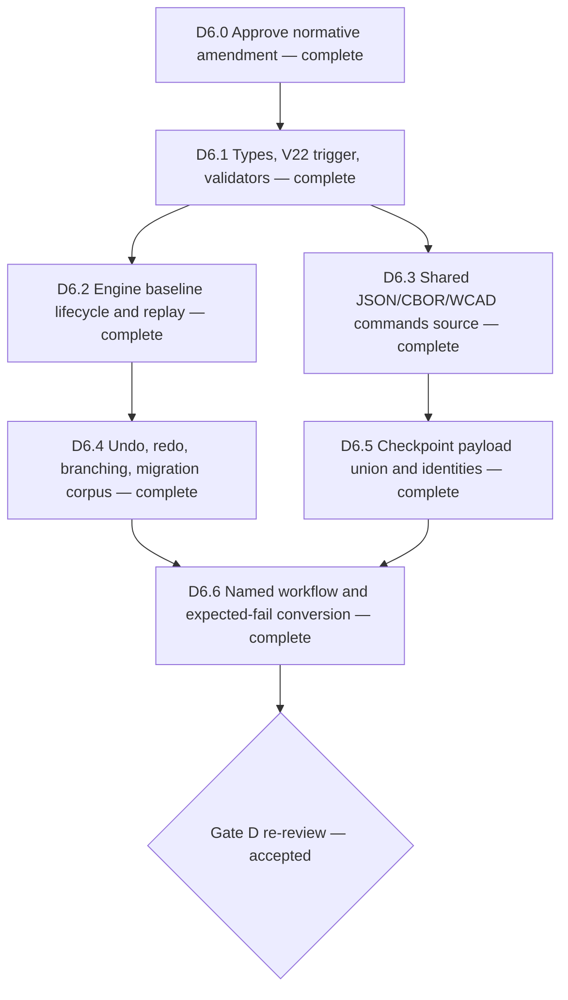

# V19 History Baseline Amendment

Status: **implemented; D6 and Gate D accepted**

Approved on 2026-07-28, this amendment resolves the remaining Gate D blocker
recorded in
[`docs/v19-implementation-dag.md`](./v19-implementation-dag.md). Its serialized
contract and invariants are now normative in [`docs/v19.md`](./v19.md).
The implementation and required proof matrix were completed and independently
accepted at Gate D on 2026-07-28.

## Problem

A valid historyless project may contain non-empty source. After its first edit,
runtime undo is correct because the transaction entry retains complete
`before` and `after` documents. Project export retains only the current
document, operation, and after-oriented semantic diff. Reimport currently
reconstructs transaction entries by replaying from an empty document, except
for the existing topology-identity seed.

The lost pre-edit state cannot be derived in general. Two historyless projects
that differ only in an overwritten parameter value can receive the same update
and then serialize to the same current document, operation, and semantic diff,
while correct undo must restore two different values. The retained legacy
`angle` compatibility update is the concrete V19 failure because V19 correctly
provides no create command from which to synthesize that old record.

Dropping history, replaying on the final document, fabricating create
transactions, or hiding state in audit metadata would lose or falsify durable
audit, undo/redo, source identity, or canonical replay.

## Approved serialized contract

Add one optional V22-only project field:

```ts
export interface CadProject {
  readonly schemaVersion: CadProjectFormatVersion;
  readonly document: CadDocumentSnapshot;
  /**
   * Exact authoritative state immediately before the chronologically earliest
   * retained transaction.
   */
  readonly historyBaseline?: CadDocumentSnapshot;
  readonly history: readonly Transaction[];
  readonly redoStack: readonly Transaction[];
}
```

For `.wcad`, place the same field beside `history` and `redoStack` in the
existing `commands.cbor` entry:

```ts
interface CadProjectCommandsSource {
  readonly historyBaseline?: CadDocumentSnapshot;
  readonly history: readonly Transaction[];
  readonly redoStack: readonly Transaction[];
}
```

This changes the optional JSON project shape and canonical commands source but
does not add or rename a `.wcad` entry and does not change
`partbench.wcad.v2`.

`historyBaseline` is a V22 minimum-schema trigger. Old projects without the
field retain their existing serialized command bytes, hashes, source
identities, replay seed, and minimum-schema behavior.

## Invariants

For baseline `B`, committed history `H`, current document `D`, and stored redo
stack `R`:

```text
replay(B, H) == D
replay(D, reverse(R)) validates every retained redo operation and diff
```

The implementation must enforce:

1. `historyBaseline` is valid only in `web-cad.project.v22`.
2. It is valid only while at least one history or redo transaction is retained.
3. It is immutable authoritative lineage source, not a derived cache.
4. It includes units, every source collection, topology identity, and all
   eight next-ID counters.
5. It uses canonical V22 document-source shapes. Retained legacy `angle`
   constraints remain legacy records.
6. It supersedes the empty/topology-only replay seed when present.
7. Undoing all transactions restores it exactly; redo order remains unchanged.
8. Branching after partial or complete undo clears redo but retains the same
   non-implicit baseline. An activated topology-only seed returns to the
   canonical implicit/omitted form when branching discards every topology
   mutation that made the explicit seed necessary.
9. Export omits a pending baseline until the first transaction is retained.
10. Export omits it for histories whose true origin is the existing canonical
    empty/topology-only seed.
11. A gratuitous baseline equal to the implicit seed is rejected so one
    canonical representation exists.
12. Any baseline mutation changes canonical command bytes, the command hash,
    and project source identity.

## Engine lifecycle

Cad-core retains a defensively cloned private pending baseline.

- A fresh engine initialized from non-implicit source records the initial
  snapshot as pending lineage.
- Loading a historyless non-empty V1-V21 project records its document as the
  pending baseline without changing its immediate unedited export.
- Loading an explicit V22 baseline preserves it.
- Loading a replay-complete legacy project without a baseline keeps the
  existing implicit replay origin as a private pending topology seed when one
  exists, so a later topology mutation can activate it before replay loses the
  pre-mutation source.
- Export includes the pending baseline only when retained lineage requires it.
- Import replays history from the baseline document and its exact counters,
  validates the current document, and then validates redo in reverse storage
  order as today.

The baseline belongs to the project lineage rather than a transaction.
Attaching it to the earliest transaction would make storage metadata move
between history and redo, require marker transfer when branching after
undo-all, and contaminate immutable authored transaction/query shapes with a
complete source document.

## Canonical JSON, CBOR, and `.wcad`

One shared commands-source helper must drive source identity, both `.wcad`
writers, and both readers:

```ts
function createCadProjectCommandsSource(
  project: CadProject
): CadProjectCommandsSource {
  return {
    ...(project.historyBaseline
      ? { historyBaseline: project.historyBaseline }
      : {}),
    history: project.history,
    redoStack: project.redoStack
  };
}
```

The baseline participates in:

- JSON validation and round-trip;
- canonical CBOR encoding;
- commands entry byte length and SHA-256;
- project/source identity;
- defensive cloning;
- V22 trigger and lower-schema refusal;
- replay, undo, redo, and branch reconstruction.

## Topology checkpoint payloads

Package payload requirements use the union of checkpoint source records in:

```text
project.document.topologyIdentity
project.historyBaseline?.topologyIdentity
```

This is required because a checkpoint may exist only in an undo-restorable
baseline after its live source was deleted. The writer and reader must:

- require payloads for every checkpoint ID in the union;
- require matching source/path/body metadata when an ID appears in both;
- validate payload links and applicable anchors against both sources;
- retain the existing B-rep, topology, and signature entry paths;
- preserve existing JSON diagnostics when binary checkpoint bytes cannot be
  carried.

`feature.delete` cascades checkpoint and anchor records owned by the removed
feature/body, prunes dependent repair records, and emits
`topologyCheckpointsDeleted` and `topologyAnchorsDeleted` semantic references.
Those V22 diff fields make the baseline-only checkpoint case replay-valid
without adding a new topology-delete command.

## Implementation DAG



Slice E was blocked until this Gate D acceptance. It is now the next unblocked
slice; this amendment does not claim any Slice E implementation.

## Required proof matrix

1. Convert the retained legacy-angle expected failure into passing
   update/export/import/undo/redo/rename/delete coverage.
2. Cover historyless non-empty V16 and V21 projects followed by ordinary
   non-V19 edits.
3. Round-trip exact baselines through JSON, canonical CBOR, and `.wcad` v2.
4. Verify all-committed, partially undone, and all-undone stack states.
5. Branch after partial undo and undo-all; prove redo clears and baseline stays.
6. Preserve non-default units and gapped next-ID counters.
7. Restore baseline-only V22 dimensions and profiles losslessly.
8. Reject missing baselines when replay targets pre-existing source.
9. Reject malformed references/counters, lower-schema baselines, transactionless
   baselines, and baseline/history/current mismatches with exact paths.
10. Prove no serialization churn for untouched historyless V1-V21 projects,
    canonical empty-origin histories, and legacy V22 projects without a
    baseline.
11. Prove canonical key-order equivalence and identity changes for every
    authoritative baseline mutation.
12. Cover baseline-only checkpoints, shared matching checkpoints, conflicting
    duplicate IDs, missing/corrupt payloads, and undo restoration.
13. Prove caller/exported-snapshot mutation cannot mutate engine authority.

## Acceptance evidence

- D6.1-D6.6 are implemented. The retained legacy-angle expected failure is a
  passing lifecycle proof, and the named
  `pnpm smoke:v19-history-baseline-workflow` command passes 8/8 checks across
  JSON and WCAD CBOR round-trips.
- The exact accepted source passes the complete workspace test command:
  cad-protocol 81, OCCT/WASM 100, renderer 17, sketch solver 85, cad-core
  1,062, geometry kernel 85, agent adapter 108, geometry worker 53, MCP adapter
  85, renderer mesh bridge 13, web 919, stdio server 21, and repository scripts
  81 passing with one intentional script skip.
- Workspace typecheck, formatting, diff checks, and lint at the error level
  pass. Lint retains eight known React fast-refresh warnings in the existing
  sketch editor/dock modules.
- Both Gate D named workflows pass 8/8. The dimensions/constraints workflow
  covers 17 literal and 15 eligible parameter targets.
- The canonical V19 production bundle audit passes with 409,482-byte critical
  JavaScript gzip, 6,515-byte critical CSS gzip, 535,611-byte all-UI JavaScript
  gzip, 249,489-byte command worker gzip, 83,272-byte geometry worker gzip, and
  the exact 13,808,536-byte OCCT WASM cap. WCAD checkpoint validation is
  deferred behind the already-asynchronous package boundary without weakening
  writer or reader validation.
- Independent adversarial storage and final Gate D reviews both returned PASS
  after exact-counter, baseline-only checkpoint, duplicate-authority,
  feature-deletion, and lower-schema writer blockers were resolved.

## Rejected alternatives

- Reverse history from the final document: old values and definitions are not
  serialized.
- Replay on the final document: updates apply twice and undo becomes a no-op.
- Synthesize create transactions: rewrites audit history and cannot create a
  legacy `angle`.
- Drop or squash history: loses durable audit, undo/redo, identities, and V22
  triggers.
- Store only a baseline hash: cannot reconstruct source.
- Store per-transaction `before` snapshots: redundant and changes authored
  transaction semantics.
- Add a new `.wcad` sidecar: unnecessary package-layout expansion.
- Reject edits: coherent only as an explicit product limitation, not complete
  V19 support.
