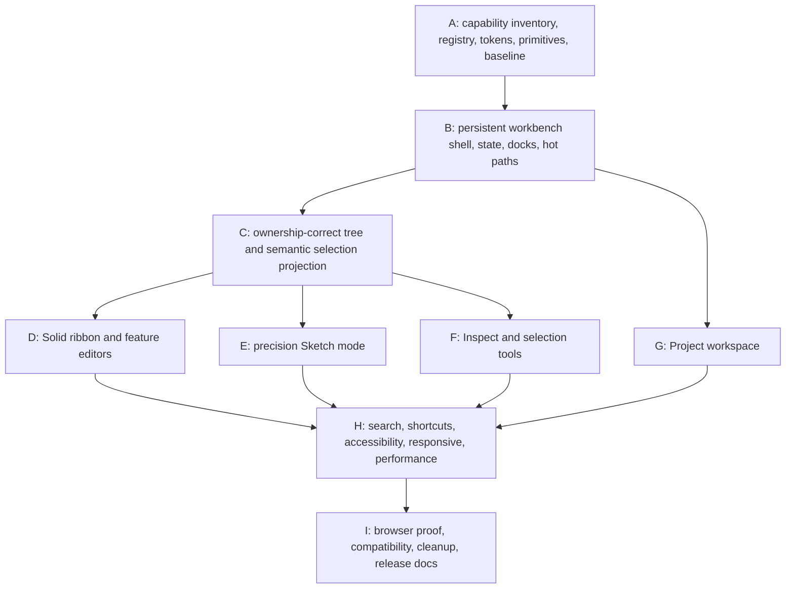

# V18 Implementation Log

Status: in progress.

This file is the auditable implementation record for the V18 Precision CAD UI
overhaul. The normative contract remains `docs/v18.md`.

## Work graph

Parallel work is limited to files with distinct ownership. Only one browser
development or smoke stack may run at a time; unit tests, typechecks, builds,
and read-only audits may run independently when they do not contend for that
stack.

## Decisions

### D001 — Direct replacement remains the delivery model

- Date: 2026-07-19
- Decision: implement the V18 workbench as the sole production shell, with no
  route, runtime flag, or legacy fallback.
- Reason: this is a non-negotiable V18 constraint and prevents duplicate
  workflow ownership.
- Consequence: every replacement slice must delete its obsolete composition,
  selectors, tests, and CSS before that slice is complete.

### D002 — Integration stays in `App.tsx` until projections are proven

- Date: 2026-07-19
- Decision: keep engine, worker, derived-geometry, storage, and command-handler
  ownership at the existing integration root while building typed presentation
  projections and callbacks around it.
- Reason: V18 is frontend-only and must not create a second command layer or
  destabilize the completed V17 boundaries.
- Consequence: presentation modules must not import the command executor,
  geometry worker, or engine; `App.tsx` will shrink as each mode owner lands.

### D003 — Visual fidelity follows capability truth

- Date: 2026-07-19
- Decision: reproduce the references' graphite header, light dense ribbon and
  docks, neutral viewport, cobalt interaction language, dimensions, and spatial
  hierarchy while omitting every image-only capability listed by V18.
- Reason: the references are visual direction, while V17 capability and the
  V18 product contract are normative.
- Consequence: omitted controls include section view, appearance editing,
  pinned measurements, vertex filtering, direct feature-field expressions, and
  unsupported sketch tools/constraints.

### D004 — Local components and CSS only

- Date: 2026-07-19
- Decision: use repository-local SVG React components and ordinary tokenized
  CSS; add no production dependency.
- Reason: the existing React/CSS stack is sufficient and V18 explicitly sets
  this default.

### D005 — Freeze the V17 baseline from an isolated source archive

- Date: 2026-07-19
- Decision: measure the immutable performance baseline from a production,
  derived-geometry-enabled build of archived commit `ac8637d`, not from the
  shared V18 worktree.
- Reason: this preserves an uncontaminated V17 comparison while parallel V18
  files are being created.
- Consequence: `scripts/v18-bundle-baseline.json` is not refreshed to excuse a
  regression; any future threshold change requires an explicit plan amendment.

### D006 — Split optional mode surfaces at their existing UI boundaries

- Date: 2026-07-19
- Decision: load the existing Project, Sketch, modeling, inspector, history,
  and exact STEP export surfaces only when their owning mode or workflow needs
  them while their V18 replacements are integrated.
- Reason: the persistent shell must not force unrelated workflows into the
  initial interaction path, and the immutable V17 bundle comparison showed the
  monolithic UI entry exceeded the V18 critical budget.
- Consequence: workers and command handlers remain unchanged; code splitting is
  a presentation-loading concern and cannot become a legacy-shell fallback.

### D007 — Project read projections are memoized by document state

- Date: 2026-07-19
- Decision: derive project structure, readiness, health, and topology lookup
  projections from document/derived state changes instead of recomputing them
  during pointer-driven viewport renders.
- Reason: hover and orbit are visual hot paths and must not re-run unrelated
  command-query projections.
- Consequence: document mutations remain the invalidation source; render meshes
  remain derived views and no geometry internals move into React components.

## Increment ledger

| Increment | Scope | Evidence | Commit |
| --- | --- | --- | --- |
| A | Inventory/foundation | 50 focused UI tests, 2 bundle-script tests, immutable V17 production metrics | `4c9c1cb` |
| B | Persistent shell/search integration | 1536/1280/960 screenshots; compact-root regression fixed; full production build; critical JS 371.93 KiB gzip and CSS 13.38 KiB gzip | Pending |

## Completion evidence

The requirement-by-requirement V18 audit will be recorded here as slices land.
Passing a narrower test does not prove a broader Must item.
