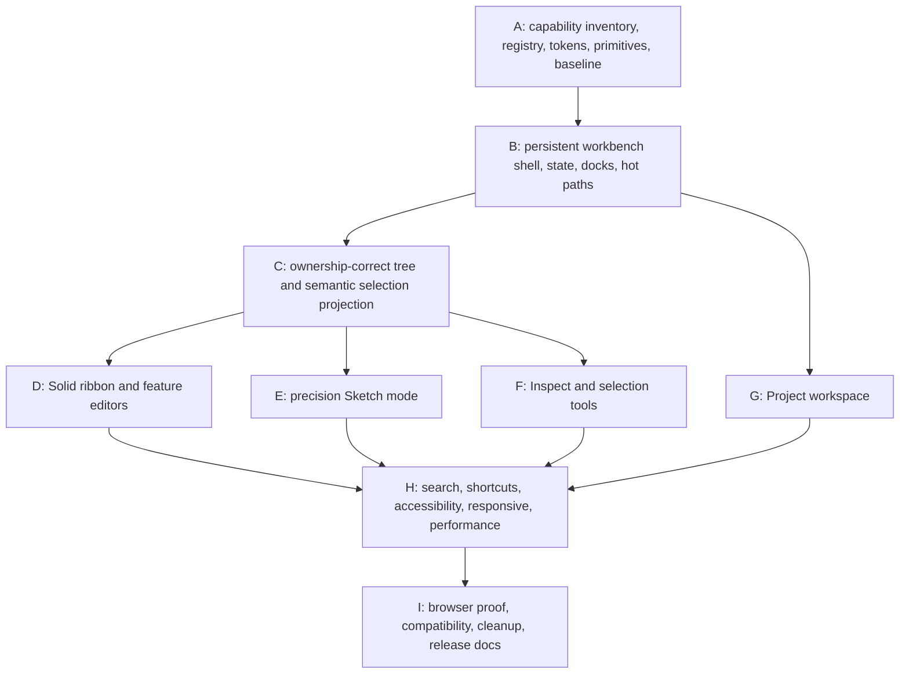

# V18 Implementation Log

Status: complete (2026-07-19).

This file is the auditable implementation record for the V18 Precision CAD UI
overhaul. The normative contract remains `docs/v18.md`.

## Work graph

Parallel work is limited to files with distinct ownership. Only one browser
development or smoke stack may run at a time; unit tests, typechecks, builds,
and read-only audits may run independently when they do not contend for that
stack.

## Decisions

### D001 — Direct replacement remains the delivery model

- Date: 2026-07-19
- Decision: implement the V18 workbench as the sole production shell, with no
  route, runtime flag, or legacy fallback.
- Reason: this is a non-negotiable V18 constraint and prevents duplicate
  workflow ownership.
- Consequence: every replacement slice must delete its obsolete composition,
  selectors, tests, and CSS before that slice is complete.

### D002 — Integration stays in `App.tsx` until projections are proven

- Date: 2026-07-19
- Decision: keep engine, worker, derived-geometry, storage, and command-handler
  ownership at the existing integration root while building typed presentation
  projections and callbacks around it.
- Reason: V18 is frontend-only and must not create a second command layer or
  destabilize the completed V17 boundaries.
- Consequence: presentation modules must not import the command executor,
  geometry worker, or engine; `App.tsx` will shrink as each mode owner lands.

### D003 — Visual fidelity follows capability truth

- Date: 2026-07-19
- Decision: reproduce the references' graphite header, light dense ribbon and
  docks, neutral viewport, cobalt interaction language, dimensions, and spatial
  hierarchy while omitting every image-only capability listed by V18.
- Reason: the references are visual direction, while V17 capability and the
  V18 product contract are normative.
- Consequence: omitted controls include section view, appearance editing,
  pinned measurements, vertex filtering, direct feature-field expressions, and
  unsupported sketch tools/constraints.

### D004 — Local components and CSS only

- Date: 2026-07-19
- Decision: use repository-local SVG React components and ordinary tokenized
  CSS; add no production dependency.
- Reason: the existing React/CSS stack is sufficient and V18 explicitly sets
  this default.

### D005 — Freeze the V17 baseline from an isolated source archive

- Date: 2026-07-19
- Decision: measure the immutable performance baseline from a production,
  derived-geometry-enabled build of archived commit `ac8637d`, not from the
  shared V18 worktree.
- Reason: this preserves an uncontaminated V17 comparison while parallel V18
  files are being created.
- Consequence: `scripts/v18-bundle-baseline.json` is not refreshed to excuse a
  regression; any future threshold change requires an explicit plan amendment.

### D006 — Split optional mode surfaces at their existing UI boundaries

- Date: 2026-07-19
- Decision: load the existing Project, Sketch, modeling, inspector, history,
  and exact STEP export surfaces only when their owning mode or workflow needs
  them while their V18 replacements are integrated.
- Reason: the persistent shell must not force unrelated workflows into the
  initial interaction path, and the immutable V17 bundle comparison showed the
  monolithic UI entry exceeded the V18 critical budget.
- Consequence: workers and command handlers remain unchanged; code splitting is
  a presentation-loading concern and cannot become a legacy-shell fallback.

### D007 — Project read projections are memoized by document state

- Date: 2026-07-19
- Decision: derive project structure, readiness, health, and topology lookup
  projections from document/derived state changes instead of recomputing them
  during pointer-driven viewport renders.
- Reason: hover and orbit are visual hot paths and must not re-run unrelated
  command-query projections.
- Consequence: document mutations remain the invalidation source; render meshes
  remain derived views and no geometry internals move into React components.

### D008 — Interleave tree sources by explicit ownership dependencies

- Date: 2026-07-19
- Decision: within each part, place each source sketch immediately before the
  first authored feature that explicitly consumes it, preserve feature order,
  then append unconsumed sketches in their recorded part order.
- Reason: the existing projection exposes ordered sketch and feature arrays but
  no combined cross-family sequence; dependency fields are the available source
  truth and require no new query or schema.
- Consequence: rows preserve actual ownership and never infer a rollback or
  insertion position that the document does not record.

### D009 — Compatibility JSON and local cache stay disclosed in Project Files

- Date: 2026-07-19
- Decision: retain editable JSON validation/import and local derived-cache
  refresh/clear under collapsed Advanced Interchange details in the Files page.
- Reason: these are completed compatibility workflows, but neither is the
  primary project experience or default visible copy.
- Consequence: malformed JSON remains a draft and cannot replace the current
  document; clearing cache remains app-local and does not mutate source.

### D010 — Ribbon actions open drafts; only Apply submits CADOps

- Date: 2026-07-19
- Decision: every Solid primitive and feature entry opens a typed, local draft
  in the right dock; no ribbon action creates geometry immediately.
- Reason: V18 requires the explicit select, parameterize, validate,
  apply/cancel loop and forbids mutation while a draft is merely open.
- Consequence: existing CADOps builders remain the only mutation boundary;
  create-mode drafts are immediately editable, edit-mode drafts begin clean,
  Apply is single-submit guarded, and Cancel restores local state without a
  transaction.

### D011 — Stable topology workflows remain explicit Inspect operations

- Date: 2026-07-19
- Decision: keep stable-reference creation, repair-plan preview, and explicit
  repair in the focused Inspect reference section alongside named-reference
  naming and repair.
- Reason: these are completed V13–V17 UI workflows recorded in the capability
  manifest; simplifying the old Inspector must not remove them.
- Consequence: repair candidates come only from the existing topology repair
  plan, internal candidate IDs stay out of visible copy, and a repair runs only
  after the user explicitly chooses the repair action.

### D012 — Retire the legacy stylesheet with its component owners

- Date: 2026-07-19
- Decision: delete `apps/web/src/styles.css` with the legacy panels and move the
  remaining live viewport/overlay rules into tokenized `styles/viewport.css`.
- Reason: retaining the broad legacy stylesheet would preserve obsolete
  selectors and undermine direct replacement even if the old components were
  no longer rendered.
- Consequence: the production CSS graph now contains only workbench, mode,
  editor, project, tree, viewport, and overlay owners.

### D013 — Prefer the actual semantic sketch selection

- Date: 2026-07-19
- Decision: when several query-supported profiles or paths exist, Solid editors
  prefer the sketch entity represented by the current semantic selection rather
  than silently choosing the first query result.
- Reason: the tree, viewport, ribbon availability, contextual strip, and editor
  collectors must agree on one selection projection.
- Consequence: query readiness remains authoritative, while user intent selects
  among ready candidates without exposing raw identifiers.

### D014 — V18 browser proof uses the live V18 owners

- Date: 2026-07-19
- Decision: the named browser harness detects the V18 shell and executes V17
  arc, construction, composite-profile, revolve, curved-sweep, retarget,
  reverse, rebuild, derived-geometry, and narrow-layout checks through the V18
  ribbon, tree, and editors. Its legacy branch remains available only for old
  archived builds.
- Reason: selector compatibility with deleted panels would not prove that the
  direct replacement retained the workflows.
- Consequence: V17 browser compatibility now exercises the production V18
  owners without introducing a fallback shell or duplicate workflow.

### D015 — Runtime measurements model compressed production delivery

- Date: 2026-07-19
- Decision: the CDP performance gate precompresses textual production assets in
  memory and serves them with content encoding, while leaving thresholds and
  the immutable bundle baseline unchanged. Long-task observation is scoped to
  the required two-second pointer interaction.
- Reason: throttling uncompressed raw JavaScript measured the test server rather
  than deployable production delivery, and charging earlier lazy-mode work to
  the pointer window mixed distinct contract metrics.
- Consequence: five clean profiles remain cache-disabled, 4x CPU/4Mbps/20ms;
  worker/WASM request deferral and all response/frame thresholds are still
  independently enforced.

## Increment ledger

| Increment | Scope | Evidence | Commit |
| --- | --- | --- | --- |
| A | Inventory/foundation | 50 focused UI tests, 2 bundle-script tests, immutable V17 production metrics | `4c9c1cb` |
| B | Persistent shell/search integration | 1536/1280/960 screenshots; compact-root regression fixed; full production build; critical JS 371.93 KiB gzip and CSS 13.38 KiB gzip | `4a54ef0` |
| C/G support | Ownership tree, Project workspace, shared editor primitives | 29 focused tests; web typecheck; 1536 Project and tree screenshots; 390 no-scroll viewport check; critical JS 370.56 KiB gzip and CSS 13.96 KiB gzip | `0e64b6a` |
| D/E/F | Solid drafts/editors, precision Sketch mode, focused Inspect, compact contextual strip, legacy retirement | 32 focused capability/action/mode tests; web typecheck; ESLint with no errors; legacy component and stylesheet graph removed | `638a53d` |
| H | Action integration, keyboard/camera routing, responsive hardening | Registry-derived availability; real selection/query routing; 41 focused tests; 1536 and narrow visual review | `f4210d4` |
| I | V17 compatibility and live V18 browser proof | Six named V17 workflows; 13-check browser result including ten V17 flows and narrow layout | `4f6b6c8` |
| Release | Bundle/runtime gates and seven deterministic visual artifacts | Critical UI 370.66 KiB gzip; shell median 1875.5ms; search p95 33.2ms; warm action p95 68.5ms; frame p95 17.1ms; zero interaction long tasks; exact-size artifact capture | `7abb02d` |

## Completion evidence

| Must | Completion evidence |
| --- | --- |
| 1 | One production `WorkbenchShell` implements Project, Sketch, Solid, feature-edit, and Inspect; the five 1536x1024 artifacts record the completed states. |
| 2 | The typed capability manifest maps every completed V17 web capability to one V18 owner, builder/effect, availability source, parity test, and retirement slice. |
| 3 | Registry projection exposes only V17-supported actions; image-only section, appearance, pinning, vertex filter, and unsupported sketch controls are absent. |
| 4 | Every source-changing handler still calls an existing typed CADOps builder/executor; no command or source schema changed. Undo/redo and semantic-diff tests remain green. |
| 5 | Tree, viewport, inspector, ribbon, search, and contextual strip share the memoized semantic selection/query projection and registry availability. |
| 6 | Solid editors use typed local drafts, collectors, validation/readiness, explicit Apply/Cancel/Delete, single-submit guards, and failure-preserving state with focused tests. |
| 7 | Sketch mode retains V17 arcs, construction, constraints, dimensions, solver/candidate state, Finish/Escape, and standard views; the named V17 browser workflow proves the live V18 paths. |
| 8 | Project owns `.wcad`, JSON under Advanced Interchange, STEP preview/import/export, GLB export, parameters, units, history, cache, and readiness surfaces. |
| 9 | Inspect owns one/two-target measurement, mass properties, naming, stable/named repair, health, and camera actions. |
| 10 | Human-copy and capability tests enforce the internal-vocabulary blacklist; IDs remain in values/test hooks, not default copy or accessible names. |
| 11 | Accessible primitives, toolbar/tab semantics, live regions, focus/Escape behavior, reduced motion, shortcut exclusions, drawers, overflow, and 1024x768/390x740 artifacts satisfy the interaction contract. |
| 12 | Legacy panels, composition, `styles.css`, imports, tests, and selectors were deleted in their replacement slices; there is no alternate route, flag, or fallback shell. |
| 13 | Changes are confined to `apps/web`, tests/scripts, and release documentation; no production dependency, public command/query/schema, geometry/renderer contract, format, or adapter behavior was added. |
| 14 | Bundle gate passes at 370.66 KiB critical JS gzip and 6.86 KiB critical CSS gzip with unchanged worker/WASM ceilings. Runtime smoke passes with no empty-shell worker/WASM request and all documented timings under budget. |
| 15 | `docs/v18-ui-artifacts` contains the five 1536x1024 reference states plus exact 1024x768 and 390x740 shell states; human review confirmed hierarchy, viewport dominance, visible Apply/Cancel, mode-correct content, and no scroll trap/internal copy. |
| 16 | Full unit/type/lint/format/build gates, bundle/performance gates, both V18/V17 browser names, and the six V17 release workflows pass. V21 stays minimum-triggered. |
| 17 | `AGENTS.md`, `docs/implementation-plan.md`, `docs/v18.md`, and this ledger are reconciled as completed V18 records. |

The machine-readable performance result is `.metrics/v18-performance.json`
(generated, not source-controlled). Deterministic visual recapture is
`pnpm capture:v18-visuals` after a production build.
