# V19 Implementation DAG

Status: **active implementation tracker**

The normative product contract remains [`docs/v19.md`](./v19.md). This file
records implementation order, parallel ownership boundaries, review gates, and
the evidence required before a node may be marked complete. It does not narrow
or amend the V19 Must matrix.

## Execution rules

1. Land slices in normative order A through I. Engineering inside a slice may
   run in parallel only when file ownership is non-overlapping.
2. Keep one owner at a time for the merge hotspots:
   `packages/cad-protocol/src/index.ts`, `packages/cad-core/src/index.ts`, and
   `apps/web/src/App.tsx`.
3. Do not advertise or enable a V19 row until its complete vertical proof
   passes from protocol through browser, adapter/MCP, storage, and release
   workflow.
4. After each large gate, run the focused and inherited tests and assign an
   adversarial reviewer who did not implement that gate. Resolve every
   correctness finding before starting the next dependent slice.
5. Commit coherent nodes iteratively. Never refresh a budget baseline merely
   to make a gate pass.

## Dependency graph

```mermaid
flowchart TD
  A0[A0 Contract and execution freeze] --> A1[A1 Protocol, limits, diagnostics]
  A1 --> A2[A2 V22 normalization and minimum schema]
  A2 --> A3[A3 CBOR, history, redo, replay, WCAD]
  A1 --> A4[A4 Public diffs, queries, adapter guards]
  A1 --> A5[A5 Bundle and performance gates]
  A3 --> GA{Gate A}
  A4 --> GA
  A5 --> GA

  GA --> B1[B1 Analytic curve policy]
  GA --> B2[B2 Source and solver identities]
  B1 --> B3[B3 Trim, extend, split, explode plans]
  B2 --> B3
  B3 --> B4[B4 Solver-record and dependency consequences]
  B4 --> B5[B5 Commands, readiness, replay, undo and redo]
  B5 --> B6[B6 Workbench and keyboard workflow]
  B5 --> B7[B7 Agent and MCP parity]
  B6 --> GB{Gate B}
  B7 --> GB

  GB --> C1[C1 Analytic offset policy]
  C1 --> C2[C2 Offset vertical row]
  GB --> C3[C3 Slot and rounded rectangle sugar]
  C2 --> C4[C4 C UI, parity, storage, undo and redo]
  C3 --> C4
  C4 --> GC{Gate C}

  GC --> D1[D1 Normalized dimension targets]
  D1 --> D2[D2 Solver residuals and branch rules]
  D1 --> D3[D3 Dimension commands, storage, units, replay]
  D1 --> D4[D4 Constraint create and structural update matrix]
  D2 --> D5[D5 D UI, parity, diagnostics]
  D3 --> D5
  D4 --> D5
  D5 --> D60[D6.0 Approve history-baseline amendment]
  D60 --> D61[D6.1 Types, V22 trigger, validators]
  D61 --> D62[D6.2 Engine lifecycle and replay]
  D61 --> D63[D6.3 JSON, CBOR, WCAD commands source]
  D62 --> D64[D6.4 Undo, redo, branch, migration corpus]
  D63 --> D65[D6.5 Checkpoint union and identities]
  D64 --> D66[D6.6 Named workflow and expected-fail conversion]
  D65 --> D66
  D66 --> GD{Gate D}

  GD --> E1[E1 Loop validation and canonicalization]
  E1 --> E2[E2 Containment discovery, limits, paging, cache]
  E2 --> E3[E3 Region queries and dependency health]
  E3 --> E4[E4 Region UI and adapter parity]
  E4 --> GE{Gate E}

  GE --> F1[F1 Exact region face and extrude recipes]
  F1 --> F2[F2 One-region new-body extrude]
  F2 --> F3[F3 Multi-region add and cut]
  F3 --> F4[F4 Metadata, topology, checkpoints, STEP]
  F4 --> F5[F5 F UI, parity, real-OCCT workflows]
  F5 --> GF{Gate F}

  GE --> G1[G1 Region revolve recipe and axis policy]
  GF --> G2[G2 One-solid real-OCCT revolve]
  G1 --> G2
  G2 --> G3[G3 Metadata, topology, checkpoints, STEP]
  G3 --> G4[G4 G UI, parity, real-OCCT workflows]
  G4 --> GG{Gate G}

  GB --> H[H Cross-cutting product audit]
  GC --> H
  GD --> H
  GE --> H
  GF --> H
  GG --> H
  H --> I[I Release proof and documentation]
  I --> RELEASE{V19 release}
```



## Nodes, owners, and proof gates

| Node | Hard prerequisites | Parallel-safe ownership | Required evidence |
| --- | --- | --- | --- |
| A0 | None | Root/documentation | Frozen public operation/query names, diagnostic spellings, limits, branch, clean baseline, and this DAG |
| A1 | A0 | Protocol owner only | V22 types, region/profile/dimension unions, V19 operations and queries, diff shapes, diagnostic codes, limits, runtime validation, protocol tests and typecheck |
| A2 | A1 | Core storage owner | V1-V22 load, V21↔V22 normalization/down-conversion, every live/history/redo trigger, malformed/mixed rejection |
| A3 | A2 | Core storage owner | Canonical JSON/CBOR, source identity, hashes, canonical diff replay, history, redo, `.wcad` v2, checkpoint payload preservation |
| A4 | A1 | Adapter owner after types freeze | Public compatibility projections, runtime guards, typed query/error/diff summaries |
| A5 | A1 | Scripts owner | Immutable V19 bundle caps, command/geometry worker accounting, inherited V18 performance checks, near-limit placeholder wired only to real proof |
| Gate A | A2-A5 | Independent reviewer | Focused protocol/storage tests, workspace typecheck, malformed corpus, lowering/refusal vectors, replay vectors, bundle/performance scripts |
| B1-B7 | Gate A and prior B node | Pure-policy owner; then serialized core owner; web and adapter owners after core API freeze | Exact analytic matrix, identities, deterministic replacements, explicit invalid-record sets, stale checks before allocation, one-edit batch rule, dry-run/commit parity, dependency health, undo/redo/replay, UI/keyboard, agent/MCP, `smoke:v19-curve-edit-workflow` |
| Gate B | B1-B7 | Independent correctness and product reviewers | Adversarial tolerance/seam/identity/dependency review; focused tests; curve-edit smoke; browser path; V17/V18 compatibility |
| C1-C4 | Gate B and prior C node | Pure-policy owner; core owner; web/adapter owners after API freeze | Every offset row and rejection, non-associative round-trip, slot 4 entities/9 constraints, rounded rectangle 8 entities/23 constraints, atomic rollback and one-step undo/redo |
| Gate C | C1-C4 | Independent correctness and product reviewers | Offset join/miter/reversal/self-intersection review, convenience cardinality/health proof, browser and parity proof |
| D1-D5 | Gate C and prior D node | Solver owner; storage/projection owner; serialized core owner; web/adapter owners after API freeze | Every Decision 13 target/value/unit/residual/branch row and Decision 14 constraint CRUD/update row, including legacy-angle compatibility |
| D6.0 | D1-D5 | Root/documentation | Explicit approval of the authoritative history-baseline amendment and synchronization into `docs/v19.md` |
| D6.1-D6.6 | D6.0 and prior D6 node; D6.2/D6.3 and D6.4/D6.5 are parallel-safe after their shared prerequisite | Protocol/core storage owner for serialized hotspots; independent migration/checkpoint owners only after API freeze | Exact optional top-level and `commands.cbor` field, V22 trigger and validation, pending-baseline lifecycle, replay/undo/redo/branching, JSON/CBOR/WCAD identities, live/baseline checkpoint union, migration corpus, named workflow, and conversion of the retained expected failure |
| Gate D | D1-D6 | Independent solver/storage/product reviewers | Determinism, rank/conflict/domain, compatibility projections, baseline-backed round-trip/replay/undo/redo, UI/agent/MCP coverage, complete D6 proof matrix, `smoke:v19-dimensions-constraints-workflow` |
| E1-E4 | Gate D and prior E node | Region-policy owner; discovery owner; serialized core owner; web/adapter owners after API freeze | Exact canonical region refs, all loop/containment/material rules, bounded whole-loop discovery, cancellation/cache/pagination, no persistent candidates, UI/keyboard and parity |
| Gate E | E1-E4 | Independent analytic/product reviewers | Adversarial nesting/touch/overlap/order/complexity review, focused tests, cache invalidation, keyboard region selection |
| F1-F5 | Gate E and prior F node | Shared face builder owner; extrude owner; topology/metadata owner; web/adapter owner | Real OCCT new body then add/cut, canonical sequential tools, positive-volume and one-solid checks, void-aware exact metadata, roles, checkpoints, STEP |
| Gate F | F1-F5 | Independent geometry/topology reviewers | Rounded plate, flange, and topology-backed multi-region cut scenarios through `smoke:v19-profile-regions-workflow` |
| G1-G4 | Gate E; G2 also requires Gate F | Revolve owner; topology/metadata owner; web/adapter owner | Real OCCT one-region-with-holes new body, full V17 axis policy, one-solid checks, exact metadata, topology/checkpoints, STEP |
| Gate G | G1-G4 | Independent geometry/topology reviewers | Revolved hollow section scenario and adversarial axis/touch/cross/void review |
| H | Gates B-G | Cross-cutting owners by file area | Single action ownership, shared availability, Apply/Cancel/Escape, undo/redo, keyboard/focus/a11y/responsive/copy, diagnostics, cache derivation, near-limit performance, lazy workers, bundle |
| I | H | Root/release owner | Six normative scenarios, eight named V19 commands, V17/V18 compatibility commands, full validation, migration corpus, non-goal audit, synchronized release docs |

## Frozen Slice A contract

- Project schema: `web-cad.project.v22`, minimum-triggered.
- Package schema: `.wcad` remains `partbench.wcad.v2`.
- New mutations: `sketch.trim`, `sketch.extend`, `sketch.split`,
  `sketch.explodeRectangle`, `sketch.offset`, `sketch.addSlot`,
  `sketch.addRoundedRectangle`, `sketch.constraint.update`, normalized V22
  forms of existing dimension create/update, and region-capable extrude/revolve
  create/update.
- New queries: `sketch.curveEditReadiness`,
  `sketch.profileRegionCandidates`, and `sketch.profileRegionValidate`.
- Source identity:
  `partbench-source-v1:<lowercase sha256>`.
- Solver evaluation identity:
  `partbench-sketch-solver-evaluation-v1:<lowercase sha256>`, or exactly
  `none` when the sketch has no solver records.
- Geometry tolerances remain linear `1e-7`, angular `0.1` degrees, and minimum
  area `1e-12`.
- Resource limits: 4,096 edited-sketch entities; 256 trim/extend boundaries;
  1,024 split points; 1,024 offset segments; 256 regions; 512 loops; 4,096
  region segment references; 512 candidates; 250,000 discovery visits;
  100,000 submitted-profile validation visits; 100 candidates per page.
- Bundle caps: critical UI JavaScript 400 KiB gzip; critical CSS 20 KiB gzip;
  all non-worker UI JavaScript 550 KiB gzip; command worker 256 KiB gzip;
  geometry worker 120 KiB gzip; OCCT WASM 13,808,536 gzip bytes.

## Frozen Slice E API clarifications

- Region query identities are relevant-sketch identities. The fingerprint
  hashes the canonical discovery-relevant sketch projection; the revision
  hashes canonical CBOR
  `[sourceFingerprint, normalizedEntityIds]`, distinguishing omitted `null`
  from explicit empty `[]` narrowing.
- Candidate keys are canonical JSON
  `["region", containmentDepth, outerLoopKey, holeLoopKeys]` display/paging
  cursors. They are never persisted or accepted by a mutation.
- Normalization string arrays contain duplicate-free, code-unit-sorted
  post-normalization loop keys.
- Public region diagnostics include empty, sketch-ownership mismatch, missing,
  unsupported, construction, repeated, and area-too-small source failures.
  Dependency health has distinct region open, intersection, boundary,
  containment, material-overlap, and complexity codes.
- Only whole-loop-backed cells may be candidates. Components that cannot
  truthfully form an exact region ref remain response diagnostics.
- E4 is a discovery/validation/selection surface. Region feature mutations and
  geometry stay disabled until their complete F/G vertical rows pass.

## Progress ledger

### 2026-07-24 — Gate A implementation accepted

- A1-A4 are implemented: strict protocol guards, V22 minimum-schema storage,
  canonical replay/history/redo, normalized in-memory dimensions, canonical
  region-source import validation, public legacy/V22 projections, and
  agent/MCP/stdio parity.
- Two independent adversarial passes were resolved. They found strict-union
  holes, legacy/V22 replay mismatches, omitted relational-dimension health,
  untyped MCP inputs, delimiter-colliding/locale-sensitive loop keys, and
  non-finite derived rectangle geometry.
- `pnpm test`, `pnpm typecheck`, `pnpm lint`, `pnpm format:check`, `pnpm build`,
  and `pnpm check:v19-bundle` pass. The bundle result is within every frozen
  V19 cap: 394,650-byte critical UI JavaScript gzip, 7,080-byte critical CSS
  gzip, 475,110-byte all-UI JavaScript gzip, 211,565-byte command worker gzip,
  83,272-byte geometry worker gzip, and 13,808,536-byte OCCT WASM gzip.
- `pnpm smoke:v19-performance` is wired and was invoked, but remains an honest
  non-green release proof: this environment has no Chromium-compatible
  browser, and the representative V19 near-limit workload remains deferred
  until the real Slice E query/cache/cancellation surfaces exist. This is an
  explicit H/I release blocker, not evidence for advertising a V19 product
  row during Slices B-D.

### 2026-07-24 — Slice B analytic and identity foundations

- B1 finite curve geometry is implemented as a pure cad-core module: line,
  circle, and signed-arc resolution; finite and support intersections;
  projection; canonical parameters; tolerance collapse; arc clipping; and
  deterministic diagnostics. Its focused suite passes 12 cases.
- B2 source-revision and solver-evaluation identities are implemented over the
  existing WCAD source digest and canonical CBOR. The identity suite passes 9
  cases, including a fixed hash vector, unordered-input equivalence, numeric
  normalization, malformed evidence, and the exact `none` policy.
- The B4 contract audit found that aggregate invalid-ID lists were
  insufficient Decision 6 evidence. `SketchCurveEditImpact` now requires
  per-constraint and per-dimension dispositions with before/after references
  and optional normalized residual evidence. The same audit froze the
  endpoint-provenance retarget matrix and identified residual-at-authored-state
  evaluation as a prerequisite to B4/B5.
- The command runner now rejects mixed or multi-edit curve batches before
  planning and has an explicit applied-operation channel for materializing
  output IDs into committed history. Curve mutation, readiness, UI, and
  adapter actions remain disabled until B3-B7 and Gate B pass.

### 2026-07-24 — Slice B planning and consequence foundations

- B3 pure planners are implemented for trim, extend, split, and derived
  rectangle explode. They preserve signed-arc direction, canonical cyclic
  intervals, exact endpoint provenance, deterministic tie rejection, and
  finite non-degenerate materialized geometry.
- B4 now enumerates every legacy and V22 solver-record target, applies the
  frozen endpoint-provenance retarget matrix, detects all direct
  topology-backed feature consumers, and derives the complete
  per-record `SketchCurveEditImpact`.
- Consequence evaluation uses exact authored post-edit coordinates with zero
  solve iterations. Structurally invalid records are excluded before the
  first residual pass, residual-invalid records before the second, and
  unsupported normalized V22 families return a typed block until Slice D
  supplies exact solver mappings.
- Two independent adversarial reviews were resolved. They found directional
  arc unwrap errors beyond 180 degrees, circle-trim seam ambiguity,
  non-deterministic extend ties, derived-rectangle overflow/collapse, a free
  solve hidden in evaluation evidence, fabricated residuals for unmapped V22
  records, family-insensitive residual tolerance, non-finite residual
  handling, and incomplete V17 geometry validation.
- B5 remains the next boundary: readiness, command application, exact delete
  list enforcement, ID materialization, semantic diffs, replay, undo, and
  redo must all use these pure planning and consequence APIs.

### 2026-07-24 — Slice B core command boundary

- B5 is implemented for trim, extend, split, and rectangle explode.
  `sketch.curveEditReadiness` returns revision-bound prepared operations,
  canonical previews, complete consequence evidence, exact deletion lists, and
  prospective output IDs. Offset remains an explicit typed blocker until
  Slice C.
- Direct dry-run/commit rechecks source revision before solver identity and
  before allocation or planning. Curve-edit batches remain one-operation-only;
  successful direct calls materialize every output ID and deletion array into
  history.
- Apply clones the sketch entity map, mutates only the planned target/results,
  explicitly retargets or deletes solver records, and emits both ordinary
  entity/record diffs and the complete curve-edit semantic diff. Dry-run and
  commit produce identical semantic evidence.
- Canonical replay requires materialized curve-edit history, skips historical
  optimistic checks, normalizes nested legacy/V22 dimension impact refs, and
  preserves exact IDs through JSON import, undo, and redo. The async command
  worker now receives the complete authoritative project so history/redo-based
  source identities remain identical off the main thread.
- Post-implementation adversarial review found and resolved document-wide
  output-ID collisions, lost worker history/redo authority, invalid evaluated
  geometry escaping as an exception, duplicate deletion lists being rejected
  before impact evidence, incomplete multi-feature dependency diagnostics,
  extend-hit preview omission, and dry-run warning wording.
- Focused B5/persistence/evaluation tests, the full protocol/core suites, core
  typecheck/lint/format checks, and the inherited web worker suite pass. B6 and
  B7 are the next parallel boundary before Gate B.

### 2026-07-25 — Gate B implementation and review accepted

- B6 exposes Trim, Extend, Split, and Explode Rectangle through the V18
  workbench without adding a second command path. The sketch drawer owns the
  query-backed collectors, exact prepared operation, complete consequence
  review, Apply/Cancel/Escape behavior, source revision, and keyboard focus.
  Ctrl/Cmd+Enter applies only a ready exact edit; dirty navigation requires an
  explicit Apply or Discard decision.
- B7 carries the same strict proposal, readiness, diagnostic, semantic-diff,
  and prepared-operation shapes through the agent adapter, MCP adapter, and
  stdio server. Full adapter suites pass with 101 agent, 80 MCP, and 16 stdio
  tests.
- Independent adversarial product and bundle reviews were resolved. Findings
  included stale visualization-export status, rejected navigation-Apply
  promises, first-load sketch pointer fall-through, command-search loading
  focus and accessibility, conflicting arc/curve-edit ownership, source
  mutation leakage, narrow drawer/footer behavior, and a compile-time
  narrowing error. The final implementation uses race-guarded lazy imports,
  reference-keyed export status, focus-safe modal fallbacks, a pointer-blocking
  sketch fallback, explicit error recovery, and one authoritative curve-edit
  owner.
- The final adversarial pass also found missing production-browser pointer
  proof and incorrect focus restoration around guarded navigation. Trusted
  pointer testing then exposed and resolved two real collector defects:
  viewport projection now intersects an exact camera ray with the sketch plane
  instead of using an affine inverse, and a pointer hit snaps analytically to
  the explicitly picked finite curve before the readiness query. Stay restores
  editor focus, while Discard and Apply preserve the requested destination
  focus instead of restoring a detached curve-editor opener. The targeted
  re-review found no remaining high- or medium-severity implementation issue.
  A later named-browser run still exposed an Apply timing race: the mounted
  guard button was mistaken for destination-owned focus. Resolved navigation
  now replaces only transient guard/editor focus and preserves meaningful
  destination focus; the rebuilt 8/8 workflow passes.
- `pnpm smoke:v19-curve-edit-workflow` passes 10/10 checks. The new
  `pnpm smoke:v19-browser-workflow` passes 8/8 against the production build:
  a trusted pointer segment proves query-backed hover and exact Split
  collection through the real canvas; an independently reset keyboard-only
  segment proves constrained Trim and finite-boundary Extend with zero pointer
  inputs; and the workflow verifies V22 fixture import, authored geometry and
  semantic diffs, single-step undo/redo, and Stay/Discard/Apply destination
  focus.
- `pnpm test`, `pnpm typecheck`, `pnpm lint`, and `pnpm format:check` pass.
  The full test run includes 871 cad-core tests, all protocol, solver,
  geometry, renderer, adapter, and transport suites, and 74 passing repository
  script tests with one intentional skip. After the final focus and
  critical-path cleanup, the complete web suite passes 872 tests and the
  repository script suite remains 74 passing with one intentional skip.
- `pnpm check:v19-bundle` passes every immutable cap on the final source:
  406,664-byte critical UI JavaScript gzip, 6,515-byte critical CSS gzip,
  511,009-byte all-UI JavaScript gzip, 231,564-byte command worker gzip,
  83,272-byte geometry worker gzip, and the exact 13,808,536-byte OCCT WASM
  gzip cap.
- The inherited V17 non-browser release workflows pass. The shared V17/V18
  production-browser workflow passes 13/13 with no failures, skips, missing
  checks, console errors, or page exceptions.
- `pnpm smoke:v19-performance` confirms the inherited V18 budget on the final
  build: 1,915.8 ms shell-ready median, 32.5 ms command-search p95, 59 ms
  warm-action p95, 17.1 ms frame-interval p95, and no long task or eager
  worker/WASM request. A repeated narrow shell-ready miss identified a
  redundant passive-effect-to-next-frame measurement boundary; the mark now
  runs from the layout effect into the frame that paints the committed shell,
  without changing the V18 cap or deferring shell work. Project-only OPFS
  inventory now starts on Project-mode entry, and Project JSON validation and
  summary work lives in the existing lazy Project chunk instead of the empty
  Solid shell. The command remains intentionally `deferred` only because the
  representative near-limit region workload requires the real Slice E query,
  cache, cancellation, and editing surfaces. This remains an H/I blocker and
  is not a Gate B failure.
- Gate B is committed and pushed on `main` at `b62bf59`.

### 2026-07-26 — Gate C pure-policy APIs accepted

- C1 and C3 were implemented in parallel and then frozen only after an
  independent adversarial review. The final focused policy suites pass 40/40
  offset tests and 28/28 slot/rounded-rectangle tests.
- Offset review found and resolved translated-loop signed-area cancellation,
  exact `0.1`/`359.9` degree arc-boundary drift, post-reconstruction output
  gaps, a small-radius reversal hidden by an over-broad angular tolerance,
  the incorrect rejection of positive sub-tolerance distances, and malformed
  caller IDs. The final policy uses anchored compensated area, a narrow
  floating reconstruction epsilon, explicit open/closed endpoint ownership,
  ordinary unconstrained output shapes, and no associative identity.
- Convenience review found and resolved finite-cancellation slot side collapse
  and large-coordinate line/arc join representability gaps. Both planners now
  validate derived spans and every canonical cyclic join before exposing exact
  4-entity/9-constraint and 8-entity/23-constraint plans.
- Protocol guards now enforce the same geometry tolerance boundary, while
  imported convenience semantic diffs require non-negative operation indexes,
  unique IDs, and exact cardinality. Focused protocol and adapter projections
  pass 13/13 and 14/14 respectively.
- C3 core execution materializes every omitted ID before history storage,
  stages all analytic entities before validating/storing the exact ordinary
  constraints, and checks production solver health without making solved
  coordinates source authority. Dry-run/commit, supplied IDs, actor/audit,
  rollback/counter isolation, one-step undo/redo, JSON/canonical-CBOR `.wcad`,
  and strict history/redo replay pass. An adversarial review found that the
  first implementation retained caller-owned point and ID arrays; committed
  operations now defensively snapshot them, and the mutation/export/replay
  regression is green. The focused C3 core+policy row passes 37/37, the full
  cad-core run passes 947 tests, and typecheck passes.
- C2 now runs offset through a distinct additive core path: sources and solver
  records remain untouched, ordinary unconstrained entities are created in
  submitted traversal order, impact replacement/record/delete/feature sets
  remain empty, and history snapshots retain every materialized output ID.
  Readiness, dry-run/commit parity, global collisions, stale-before-allocation,
  defensive input snapshots, one-step undo/redo, JSON/canonical-CBOR `.wcad`,
  and strict history/redo replay pass.
- Replacement edits and offset share one exact authored-residual evaluator
  with zero free-solve iterations. No-record offset reports `not-run`; an
  eligible over-defined source is classified against the complete post state,
  where the new unconstrained output correctly makes it under-defined.
  The batch-error union now includes `SKETCH_EDIT_INVALID_PROPOSAL`, removing
  the temporary runtime-code cast used by collision diagnostics.
- Independent C2 adversarial review found and resolved a finite
  representability defect: at coordinates/radii near `1e16`, a positive
  `0.1` offset could round back to unchanged line, circle, arc, rectangle, or
  chain geometry. Publication now requires a finite, non-zero, correct-sign
  analytic support/span delta within a narrow intent-relative roundoff bound;
  representable positive `1e-8` offsets remain supported. The final pure
  offset suite passes 44/44, the reviewer rerun passes 65/65, the expanded
  C1-C3 focused gate passes 121/121, and the full cad-core suite passes
  966/966 with typecheck, lint, format, and diff checks green.
- C4 UI, capability advertisement, agent/MCP execution, keyboard behavior, and
  browser proof remain gated on this accepted core API.

### 2026-07-26 — Gate C implementation and review accepted

- C4 exposes Offset, Slot, and Rounded Rectangle through one V18 action owner
  each. Offset supports query-backed individual and oriented-chain selection,
  exact distance/side/witness submission, pointer and keyboard collection, and
  ordinary non-associative output. Slot and Rounded Rectangle compile only to
  `sketch.addSlot` and `sketch.addRoundedRectangle`; their committed source is
  the exact ordinary 4-entity/9-constraint and 8-entity/23-constraint result.
- All three editors preserve the shared Apply/Cancel/Escape and dirty
  navigation contract. Labels are semantic rather than raw IDs, cancel and
  discard preserve document/history/redo state, destination focus is restored
  after guarded navigation, and each committed operation is one-step
  undo/redo.
- Agent, MCP, and stdio parity is complete for the three Gate C operations.
  Batch schemas have exact offset/slot/rounded-rectangle branches, closed
  additional properties, exact lowercase source/solver identity patterns, and
  an explicit non-V19 legacy branch. Public results retain additive offset
  intent, ordinary output IDs, convenience cardinality, and
  non-associativity.
- Three independent adversarial reviews were resolved. Product review found
  winding-blind and then translation-sensitive closed-chain witness logic;
  the UI now mirrors the core's oriented, locally anchored, compensated
  signed-area policy, including reversed arcs and the shared minimum-area
  threshold. Adapter review found an under-constrained MCP batch schema and
  solver-identity documentation drift. Browser review found weak action,
  authored-source, cancel/escape, and focus proof. The final re-review also
  found two lazy OPFS rejection paths; module-load/action failures now produce
  visible structured status, while single-flight mesh-cache loading resets
  after rejection and retries. Every re-review is PASS.
- Production cache and STEP-only code now loads behind retry-safe boundaries.
  The critical-entry build uses a second Terser pass only after normal esbuild
  minification; Terser is a BSD-2-Clause dev-only build dependency and adds no
  runtime code. Lazy chunks and both workers remain included in their frozen
  aggregate budgets, so no artifact was reclassified to pass.
- The complete web suite passes 891 tests after the final lazy-load rejection
  coverage. Full agent/MCP/stdio suites pass 103/82/18 tests; focused product,
  MCP-schema, browser-contract, cache, and workflow suites pass. Workspace
  typecheck, repository lint, formatting, and diff checks are green.
- Canonical `pnpm check:v19-bundle` passes every immutable cap on the final
  source: 404,758-byte critical UI JavaScript gzip, 6,515-byte critical CSS
  gzip, 519,657-byte all-UI JavaScript gzip, 242,636-byte command worker gzip,
  83,272-byte geometry worker gzip, and the exact 13,808,536-byte OCCT WASM
  gzip cap.
- `smoke:v19-browser-workflow` v2 passes 16/16 against that exact production
  build. It preserves all eight Gate B proofs and adds unique rendered action
  ownership, trusted-pointer and keyboard-only offsets, exact non-default
  convenience inputs and authored geometry/constraint signatures, independent
  Cancel/Escape state snapshots, analytic authority, focus/accessibility, and
  one-step undo/redo.
- The inherited V18 performance gate passes on the final build with a
  1,890.1 ms shell-ready median, 48.3 ms command-search p95, 56.4 ms warm-action
  p95, 17 ms frame-interval p95, no long task, and no eager worker/WASM
  request. The V19 near-limit region workload remains intentionally deferred
  until Slice E supplies the real region query/cache/cancellation surfaces;
  this remains an H/I release blocker, not a Gate C blocker.
- Gate C is accepted. D1 normalized dimension targets are the next normative
  implementation boundary.

### 2026-07-26 — Slice D normalized-dimension and constraint core checkpoint

- D1-D4 core execution is implemented. Normalized V22 scalar, point-pair,
  point-line, and line-angle dimensions now create, retarget, solve, query,
  diff, scale, export/import, replay, undo, and redo through the command
  engine. Rectangle width/height remain direct source updates; radius and
  diameter share one solver variable with exact 2x command/storage behavior.
- The numerical solver and CAD mapper implement Euclidean distance, directed
  horizontal/vertical components, signed infinite-support point-line distance,
  and clockwise/counterclockwise authored line-angle branches. Family
  tolerances, zero-length diagnostics, arc branch preservation, deterministic
  conflict evidence, and direct rectangle curve-edit evidence are covered by
  focused and inherited tests.
- Decision 14 structural planning and command execution are live.
  `equalLength` create and every typed `sketch.constraint.update` definition
  preserve kind/name/sketch ownership and normalize point inputs to the
  existing V21 storage shapes. Equal-length is independent of directional
  pairs, unordered duplicates are deterministic, advanced symmetric duplicate
  checks are enforced, and legacy angle remains update-only.
- Three adversarial passes found and resolved legacy-history rejection,
  mixed-input ambiguity, non-exact imported value sources, zero-length import
  holes, signed-sweep protocol drift, angular convergence drift, rectangle
  curve-edit blocking, equal-length propagation, pair-family conflation, and
  inaccurate update paths. Solver re-review is PASS; storage and constraint
  re-reviews report only remaining release-proof breadth assigned to D5.
- Full solver, protocol, and cad-core suites pass 85, 81, and 1,020 tests.
  D5 remains open: every Decision 14 row still needs command/product/adapter
  lifecycle proof, the complete normalized literal/parameter unit matrix, the
  named dimensions/constraints smoke workflow, and browser-accessible UI
  coverage before Gate D can be accepted.

### 2026-07-26 — Slice D product and parity checkpoint

- D5 implementation is complete across the browser, agent adapter, MCP
  adapter, stdio server, and named workflow. The sketch workbench now owns all
  11 Decision 13 dimension families and all 12 creatable Decision 14
  constraint families through the shared action registry. Legacy `angle`
  remains compatibility update/rename/delete-only and is not exposed as a
  second create path.
- The browser editor uses normalized targets, literal/eligible-parameter value
  sources, exact geometric measurements, exhaustive conflict-aware target
  enumeration, signed analytic arc endpoints, positive authored sweep
  magnitudes, and exact direction/side/sense defaults. The same 23-row
  availability projection feeds ribbon, command search, inspector, and
  viewport contextual actions.
- Drafts follow the V18 editor contract: one active session, awaited Apply,
  rejected-draft retention, Ctrl/Cmd+Enter, dirty navigation guard,
  Apply/Discard/Stay, stable direct-panel and action-opener focus restoration,
  inspector-tab ownership, actionable blocked states, human diagnostics,
  structural target summaries, and associated validation copy. Local
  validation does not claim a solver preflight that has not run.
- Agent, MCP, and stdio runtime guards are exact and closed. They cover the
  literal and eligible parameter target matrices, both branch directions,
  Decision 14 create/update/rename/delete lifecycles, normalized V22
  projections, and strict rejection of unknown, screenshot, filesystem-path,
  and opaque-token fields. Their full suites pass 108, 85, and 21 tests.
- `pnpm smoke:v19-dimensions-constraints-workflow` passes 8/8 checks across 17
  literal targets, 15 eligible parameter targets, unit modes, radius/diameter
  behavior, branch choices, deterministic conflict rollback, replay,
  undo/redo, and constraint lifecycle diffs.
- Two independent product reviews were resolved. The reviews found incomplete
  action ownership, draft/navigation bypasses, first-candidate availability,
  fabricated relational defaults, raw diagnostic leakage, missing target
  summaries, arc endpoint and clockwise-sweep errors, contextual projection
  drift, silent draft replacement, inspector-tab unmounts, and direct-panel
  focus loss. The final read-only re-review is PASS with no remaining blocker
  or major and independently passes 86 focused tests plus web typecheck.
- The exact final source passes the complete repository test command: cad-core
  reports 1,039 passing tests plus the one intentional historyless-import
  expected-fail; web reports 915; repository scripts report 79 passing with
  one skip; all other package suites pass. Workspace typecheck, lint,
  formatting, and diff checks are green.
- A fresh production build and immutable metrics pass with 409,163-byte
  critical UI JavaScript gzip, 6,515-byte critical CSS gzip, 532,108-byte
  all-UI JavaScript gzip, 248,244-byte command worker gzip, 83,272-byte
  geometry worker gzip, and the exact 13,808,536-byte OCCT WASM cap.

Gate D is not yet accepted. A valid historyless V21 snapshot can retain a
legacy `angle`, accept its V19 compatibility update, and export V22 history
containing only that update. Reimport must replay from an empty document and
therefore cannot reconstruct the pre-update legacy record; the same baseline
problem exists for ordinary edits to any non-empty historyless imported
snapshot. The focused lifecycle suite records this honestly as an expected
failure. The only sound choices were a serialized history-baseline amendment
to the frozen V22 shape or an explicit product-contract limitation for edits
to historyless imported snapshots; the approved D6 contract below selects the
history baseline.

### 2026-07-28 — D6 history-baseline implementation and Gate D accepted

- The serialized history-baseline amendment is approved and incorporated into
  the normative V19 contract. D6.0-D6.6 are complete.
- `historyBaseline` is an optional top-level V22 source and lives beside
  `history` and `redoStack` in the existing `.wcad` `commands.cbor` entry. It
  is authoritative lineage, participates in canonical bytes/hashes/source
  identity, and is a V22 minimum-schema trigger.
- The approved lifecycle, replay invariants, live/baseline topology-checkpoint
  union, D6.1-D6.6 graph, and required proof matrix are recorded in
  [`docs/v19-history-baseline-amendment.md`](./v19-history-baseline-amendment.md).
- Engine import/export now preserves the exact pre-history V22 snapshot and all
  eight counters across committed, partial-undo, all-undone, redo, and branch
  states while untouched baseline-free projects retain their existing bytes,
  identities, and minimum schemas.
- JSON and both WCAD package versions share one canonical commands projection.
  WCAD v2 unions live and baseline checkpoint authority, requires every
  payload, coalesces matching metadata and anchors, rejects conflicts, and
  restores baseline-only feature/profile/checkpoint state through undo.
  `feature.delete` removes owned checkpoint/anchor authority and dependent
  repairs with V22 deletion references so replay remains exact.
- The retained expected failure is converted to passing coverage.
  `pnpm smoke:v19-history-baseline-workflow` and
  `pnpm smoke:v19-dimensions-constraints-workflow` each pass 8/8.
- Two independent adversarial reviews accepted the exact storage and Gate D
  contracts after counter, checkpoint-union, writer-refusal, deletion, and
  source-link blockers were resolved.
- The complete exact-source workspace test command passes: cad-core 1,062,
  web 919, repository scripts 81 with one intentional skip, and every other
  package suite green. Workspace typecheck, formatting, diff checks, and lint
  at the error level pass.
- The canonical production audit passes with 409,482-byte critical JavaScript
  gzip, 6,515-byte critical CSS gzip, 535,611-byte all-UI JavaScript gzip,
  249,489-byte command worker gzip, 83,272-byte geometry worker gzip, and the
  exact 13,808,536-byte OCCT WASM cap.
- Gate D is accepted. E1 is the next unblocked node; no Slice E implementation
  is claimed by this checkpoint.

### 2026-07-28 — Slice E1 region-policy checkpoint accepted

- The Slice E API clarifications are frozen: relevant-sketch fingerprint,
  narrowing-bound revision, canonical display-only candidate keys, public
  source/health diagnostics, post-normalization loop-key evidence, and the
  E/F/G capability boundary.
- Explicit region validation is a pure, bounded cad-core API with scoped
  sketch ownership. It returns exact public validation responses, canonical
  outer/hole winding and cyclic starts, deterministic hole/region order,
  per-loop normalization evidence, material areas, complexity, and
  containment depths.
- Entity loops do not count as wire segment references. Canonical tuple
  comparison uses raw code-unit field ordering even for escaped IDs, and
  analytic relation work uses canonical region/hole order so predicate-budget
  behavior is input-order independent.
- An independent adversarial review found and resolved escaped-ID ordering,
  ownership, complexity-accounting, and order-dependent predicate issues. Its
  final verdict is PASS.
- The reviewer independently passes 1,066 cad-core tests, 83 protocol tests,
  both package typechecks, and diff checks. Focused storage/validator/protocol
  integration tests pass 49/49.
- E1 is accepted. E2 whole-loop discovery, containment cells, identities,
  limits, and pagination is the next unblocked node. Gate E is not yet
  accepted.

### 2026-07-28 — Slice E2 analytic discovery checkpoint accepted

- The pure E2 engine discovers only complete rectangle/circle entities and
  degree-two whole line/arc components. Open, branched, unsupported, and
  construction-narrowed inputs remain structured response diagnostics; no
  partial curve or virtual intersection becomes a candidate ref.
- A deterministic endpoint sweep and analytic loop-pair sweep share the frozen
  250,000-visit budget. One containment-tree node produces one material cell
  with direct children as holes at every depth. The complete result is capped
  at 512 before paging and never leaks partial success.
- Relevant-sketch fingerprints, narrowing-bound revisions, role-specific
  canonical loop refs, exact display-only candidate keys, canonical
  depth/area/key ordering, page cursors, stale revisions, and unknown cursors
  are implemented and tested.
- Analytic boundary separation includes interior line/arc stationary points
  and symmetric arc/circle and arc/arc extrema so near-tolerance contact is
  not reduced to endpoint sampling.
- An independent adversarial review found and resolved mixed missing
  narrowing, false repeated-ID diagnostics, invalid-cursor counts,
  construction-exclusion behavior, and analytic closest-distance gaps. Its
  final verdict is PASS.
- Focused discovery/validation/protocol tests pass 42/42; the complete
  cad-core suite passes 50 files and 1,075 tests, and cad-core typecheck passes.
- This accepts the E2 pure analytic checkpoint only. Browser command-worker
  execution, cancellation, relevant-revision cache behavior, and no-persistence
  proof remain required before E2 and Gate E are complete.

### 2026-07-28 — Slice E3 core query and health checkpoint accepted

- The engine now dispatches the exact region candidate and validation queries
  through the pure E1/E2 policy. Strict runtime guards cover their full request
  and response envelopes, including every region readiness diagnostic.
- V17 profile candidates retain their existing shape and gain deterministic
  links to matching region candidates. Region readiness enforces the bounded
  extrude/revolve consumer matrix while sweep, loft, and all region feature
  mutations remain disabled until their complete F/G geometry rows pass.
- Feature, body, summary, dependency-graph, rebuild, reference-health,
  project-health, editability, package/export-readiness, topology, and mass
  projections understand exact region source without treating derived
  candidates as authored data.
- Retained-ID sketch edits preserve the authored region refs and expose exact
  open/intersection/boundary/containment diagnostics. Undo and redo restore or
  reapply readiness, while import accepts geometric drift only when a strict
  V22 history baseline and replayable retained history prove its provenance;
  standalone malformed or noncanonical sources still fail import.
- Deferred region topology identities include the canonical region refs,
  referenced sketch geometry, resolved sketch frame, revolve-axis evidence,
  and bounded add/cut target lineage. Matching old exact metadata becomes stale
  after a retained source or target edit.
- An independent adversarial review found and resolved direct-command boundary
  bypasses, stale topology identity, target-lineage omission, overclaimed
  geometry health, imprecise editability diagnostics, incomplete protocol
  guards, legacy dependency labels, and a global import-validation relaxation.
  Its final verdict is PASS.
- The complete cad-core suite passes 51 files and 1,087 tests; cad-protocol
  passes 4 files and 83 tests. Both package typechecks, Prettier, and
  `git diff --check` pass.
- This accepts the E3 core checkpoint. Browser command-worker cancellation and
  relevant-revision cache/no-persistence proof remain open E2 work; E4 browser
  selection and adapter parity plus Gate E remain unaccepted.

### 2026-07-28 — Slice E4 and Gate E accepted

- The production Material Regions action is now owned by the shared V18 action
  registry and opens one exact region-selection workflow. The browser presents
  deterministic paginated candidates, even-odd material shading, pointer and
  keyboard selection, explicit outer/hole membership, consumer-count
  readiness, validation-only Apply, and mutation-free Cancel/Escape behavior.
- Exact discovery and validation run through one recoverable shared browser
  query worker. Requests carry the relevant-sketch fingerprint and narrowing
  revision; cache keys exclude unrelated document state, invalidation follows
  relevant source/solver changes, stale responses cannot publish, and
  cancellation yields before a superseded result can be consumed. Region
  candidates remain derived query output and are never persisted.
- Large-sketch evaluation, health, curve-readiness, path, region, canvas, and
  entity-row work is progressive. The 512-candidate proof traverses six pages,
  proves revision invalidation and cancellation, and keeps pointer-to-feedback,
  frame, and long-task measurements within the frozen V19 budgets.
- The agent adapter, MCP adapter, and stdio MCP server expose the same bounded
  candidate and validation queries with the same response guards and no extra
  mutation authority. Renderer material-region overlays consume only explicit
  validated loop geometry; no query path loads OCCT.
- Command commits now prepare and validate a batch once, and private undo/redo
  roots share immutable document maps. Browser document publication waits for
  the exact committed revision before dependent query work continues, avoiding
  stale-region reads without weakening public document-copy isolation.
- Adversarial workflow repair covered off-window keyboard collection, shared
  worker lifecycle expectations, complete worker-response audit history,
  focused-sketch fallback, and exact committed-revision publication.
- The complete cad-core suite passes 52 files and 1,089 tests, and the complete
  web suite passes 116 files and 956 tests. Focused workflow-script tests pass
  18/18. The browser workflow passes all 24 Gate B/C/E checks. The named
  `smoke:v19-performance` proof passes with 512 candidates, six pages,
  cancellation and revision invalidation, 14.4 ms pointer feedback, 17.2 ms
  frame p95, no long task, no OCCT, and all bundle/worker budgets green
  (critical JavaScript 408,288/409,600 gzip bytes).
- This accepts Slice E4 and Gate E. Region extrude and revolve remain disabled:
  Gates F and G still require their complete real-OCCT geometry, metadata,
  topology, STEP, UI, adapter, storage, and named-workflow proof.

### 2026-07-28 — Slice F region extrude and Gate F accepted

- `feature.extrude` now accepts exact V22 `regions` profiles for the approved
  rows: one-region `newBody`, followed by canonical multi-region `add` and
  `cut`. New-body rejects multiple material regions, while add/cut require
  their existing target-body or topology-anchor contracts.
- The browser geometry recipe builds exact entity or resolved-wire faces,
  subtracts every canonical hole, and applies multi-region boolean tools in
  canonical order. Real OCCT execution enforces one resulting solid and a
  positive material-volume effect at every region step, with structured
  `SKETCH_REGION_RESULT_NOT_SINGLE_SOLID` failures rather than accepting
  disconnected or ineffective results.
- Region result bodies now carry stable source-semantic face/edge references,
  exact metadata and mass properties, topology identities and health,
  checkpoint payloads, recursive boolean source evidence, and exact STEP
  export. The proof covers a rounded plate with a slot void, a four-hole
  flange, and a topology-anchor-backed two-region cut.
- The Material Regions collector owns depth, side, operation mode, and target
  body inputs and commits through the shared `feature.extrude` command. Agent
  and MCP guards expose the same exact profile envelope and do not add a
  separate geometry path. Region revolve remains validation-only until Gate G.
- Exact region policy and source-recipe construction stay out of the empty
  browser graph. The validation registry loads before a region commit or V22
  project import, while exact source construction loads only after an
  authoritative document contains model sources. Release-sample fixtures are
  excluded from the browser entry without changing the default cad-core API.
- `pnpm smoke:v19-profile-regions-workflow` passes its 5/5 real-geometry
  checks. The production browser workflow passes all 29 Gate B/C/E/F checks,
  including trusted keyboard creation, authored V22 source and semantic diff,
  successful `occt_mesh` worker output with independently observed OCCT WASM
  bytes, and single-step undo/redo.
- The immutable bundle audit passes with 407,933-byte critical JavaScript
  gzip, 6,608-byte critical CSS gzip, 559,164-byte all-UI JavaScript gzip,
  261,366-byte command worker gzip, 83,773-byte geometry worker gzip, and the
  exact 13,808,536-byte OCCT WASM cap.
- Gate F is accepted. G1 region revolve is the next unblocked node; no region
  revolve, Gate H audit, Gate I release proof, or completed V19 release is
  claimed by this checkpoint.

### 2026-07-30 — Slice G region revolve and Gate G accepted

- `feature.revolve` and `feature.updateRevolve` now accept one exact V22
  `regions` profile for the approved new-body row only. The command layer
  rejects multiple regions, target-body modes, cross-sketch axes, invalid
  angles, and non-canonical or stale source refs without creating a feature.
- The exact recipe constructs one OCCT face from the canonical outer wire and
  every hole, then performs one partial or full revolve. It inherits the V17
  axis policy: separated axes and outer-vertex contact are accepted, while
  outer-edge overlap, material crossing, circle-interior tangency, and
  hole-axis contact within linear tolerance are rejected.
- Real OCCT proof covers full and partial hollow revolves, one connected valid
  solid, exact volume and mass properties, display tessellation, exact
  metadata, topology identity and health, checkpoint payloads, and STEP
  export from the same retained source recipe.
- Region-revolve results expose source-semantic body and axis references only;
  no unproven rich face/edge correspondence was added. Project health,
  editability, export readiness, storage replay, authoritative semantic diffs,
  and V22 JSON/canonical-CBOR/`.wcad.v2` round-trips all retain the authored
  region and axis refs. The `.wcad` proof includes a real generated B-rep
  checkpoint payload and byte-exact checkpoint recovery.
- The Material Regions collector owns the axis and angle draft and submits the
  shared `feature.revolve` command through its documented Ctrl/Cmd+Enter Apply
  path. Agent, MCP, and stdio parity tests cover create, update, dry-run,
  commit, audit, and inspection through the same command authority; core owns
  the rejected consumer and axis matrix.
- `pnpm smoke:v19-profile-regions-workflow` passes its expanded 9/9
  real-geometry checks. The production browser workflow passes all 34
  Gate B/C/E/F/G checks, including trusted keyboard creation, exact worker
  output, authored feature/diff inspection, and single-step undo/redo.
- The immutable bundle audit passes with 408,763-byte critical JavaScript
  gzip, 6,608-byte critical CSS gzip, 560,380-byte all-UI JavaScript gzip,
  256,936-byte command worker gzip, 84,769-byte geometry worker gzip, and the
  exact 13,808,536-byte OCCT WASM cap.
- Gate G is accepted. Gate H cross-cutting audit is the next unblocked node;
  no Gate H audit, Gate I release proof, or completed V19 release is claimed
  by this checkpoint.

## Completion audit

Release completion requires affirmative evidence for each numbered Must item
in `docs/v19.md`, preserving its 1-23 numbering. In particular, green helper
tests are not evidence for a product row unless the complete vertical slice,
real OCCT proof where required, browser behavior, adapter/MCP parity, storage,
and named release workflow all pass.

The mandatory final commands are:

```sh
pnpm test
pnpm typecheck
pnpm lint
pnpm format:check
pnpm build
pnpm check:v19-bundle
pnpm smoke:v19-performance
pnpm smoke:v17-release-samples
pnpm smoke:v17-arcs-profiles-workflow
pnpm smoke:v17-composite-features-workflow
pnpm smoke:v17-curved-sweep-workflow
pnpm smoke:v17-storage-migration-workflow
pnpm smoke:v17-browser-workflow
pnpm smoke:v18-browser-workflow
pnpm smoke:v19-release-samples
pnpm smoke:v19-curve-edit-workflow
pnpm smoke:v19-dimensions-constraints-workflow
pnpm smoke:v19-profile-regions-workflow
pnpm smoke:v19-storage-migration-workflow
pnpm smoke:v19-browser-workflow
```
