# V19 Implementation DAG

Status: **active implementation tracker**

The normative product contract remains [`docs/v19.md`](./v19.md). This file
records implementation order, parallel ownership boundaries, review gates, and
the evidence required before a node may be marked complete. It does not narrow
or amend the V19 Must matrix.

## Execution rules

1. Land slices in normative order A through I. Engineering inside a slice may
   run in parallel only when file ownership is non-overlapping.
2. Keep one owner at a time for the merge hotspots:
   `packages/cad-protocol/src/index.ts`, `packages/cad-core/src/index.ts`, and
   `apps/web/src/App.tsx`.
3. Do not advertise or enable a V19 row until its complete vertical proof
   passes from protocol through browser, adapter/MCP, storage, and release
   workflow.
4. After each large gate, run the focused and inherited tests and assign an
   adversarial reviewer who did not implement that gate. Resolve every
   correctness finding before starting the next dependent slice.
5. Commit coherent nodes iteratively. Never refresh a budget baseline merely
   to make a gate pass.

## Dependency graph

```mermaid
flowchart TD
  A0[A0 Contract and execution freeze] --> A1[A1 Protocol, limits, diagnostics]
  A1 --> A2[A2 V22 normalization and minimum schema]
  A2 --> A3[A3 CBOR, history, redo, replay, WCAD]
  A1 --> A4[A4 Public diffs, queries, adapter guards]
  A1 --> A5[A5 Bundle and performance gates]
  A3 --> GA{Gate A}
  A4 --> GA
  A5 --> GA

  GA --> B1[B1 Analytic curve policy]
  GA --> B2[B2 Source and solver identities]
  B1 --> B3[B3 Trim, extend, split, explode plans]
  B2 --> B3
  B3 --> B4[B4 Solver-record and dependency consequences]
  B4 --> B5[B5 Commands, readiness, replay, undo and redo]
  B5 --> B6[B6 Workbench and keyboard workflow]
  B5 --> B7[B7 Agent and MCP parity]
  B6 --> GB{Gate B}
  B7 --> GB

  GB --> C1[C1 Analytic offset policy]
  C1 --> C2[C2 Offset vertical row]
  GB --> C3[C3 Slot and rounded rectangle sugar]
  C2 --> C4[C4 C UI, parity, storage, undo and redo]
  C3 --> C4
  C4 --> GC{Gate C}

  GC --> D1[D1 Normalized dimension targets]
  D1 --> D2[D2 Solver residuals and branch rules]
  D1 --> D3[D3 Dimension commands, storage, units, replay]
  D1 --> D4[D4 Constraint create and structural update matrix]
  D2 --> D5[D5 D UI, parity, diagnostics]
  D3 --> D5
  D4 --> D5
  D5 --> GD{Gate D}

  GD --> E1[E1 Loop validation and canonicalization]
  E1 --> E2[E2 Containment discovery, limits, paging, cache]
  E2 --> E3[E3 Region queries and dependency health]
  E3 --> E4[E4 Region UI and adapter parity]
  E4 --> GE{Gate E}

  GE --> F1[F1 Exact region face and extrude recipes]
  F1 --> F2[F2 One-region new-body extrude]
  F2 --> F3[F3 Multi-region add and cut]
  F3 --> F4[F4 Metadata, topology, checkpoints, STEP]
  F4 --> F5[F5 F UI, parity, real-OCCT workflows]
  F5 --> GF{Gate F}

  GE --> G1[G1 Region revolve recipe and axis policy]
  GF --> G2[G2 One-solid real-OCCT revolve]
  G1 --> G2
  G2 --> G3[G3 Metadata, topology, checkpoints, STEP]
  G3 --> G4[G4 G UI, parity, real-OCCT workflows]
  G4 --> GG{Gate G}

  GB --> H[H Cross-cutting product audit]
  GC --> H
  GD --> H
  GE --> H
  GF --> H
  GG --> H
  H --> I[I Release proof and documentation]
  I --> RELEASE{V19 release}
```



## Nodes, owners, and proof gates

| Node | Hard prerequisites | Parallel-safe ownership | Required evidence |
| --- | --- | --- | --- |
| A0 | None | Root/documentation | Frozen public operation/query names, diagnostic spellings, limits, branch, clean baseline, and this DAG |
| A1 | A0 | Protocol owner only | V22 types, region/profile/dimension unions, V19 operations and queries, diff shapes, diagnostic codes, limits, runtime validation, protocol tests and typecheck |
| A2 | A1 | Core storage owner | V1-V22 load, V21↔V22 normalization/down-conversion, every live/history/redo trigger, malformed/mixed rejection |
| A3 | A2 | Core storage owner | Canonical JSON/CBOR, source identity, hashes, canonical diff replay, history, redo, `.wcad` v2, checkpoint payload preservation |
| A4 | A1 | Adapter owner after types freeze | Public compatibility projections, runtime guards, typed query/error/diff summaries |
| A5 | A1 | Scripts owner | Immutable V19 bundle caps, command/geometry worker accounting, inherited V18 performance checks, near-limit placeholder wired only to real proof |
| Gate A | A2-A5 | Independent reviewer | Focused protocol/storage tests, workspace typecheck, malformed corpus, lowering/refusal vectors, replay vectors, bundle/performance scripts |
| B1-B7 | Gate A and prior B node | Pure-policy owner; then serialized core owner; web and adapter owners after core API freeze | Exact analytic matrix, identities, deterministic replacements, explicit invalid-record sets, stale checks before allocation, one-edit batch rule, dry-run/commit parity, dependency health, undo/redo/replay, UI/keyboard, agent/MCP, `smoke:v19-curve-edit-workflow` |
| Gate B | B1-B7 | Independent correctness and product reviewers | Adversarial tolerance/seam/identity/dependency review; focused tests; curve-edit smoke; browser path; V17/V18 compatibility |
| C1-C4 | Gate B and prior C node | Pure-policy owner; core owner; web/adapter owners after API freeze | Every offset row and rejection, non-associative round-trip, slot 4 entities/9 constraints, rounded rectangle 8 entities/23 constraints, atomic rollback and one-step undo/redo |
| Gate C | C1-C4 | Independent correctness and product reviewers | Offset join/miter/reversal/self-intersection review, convenience cardinality/health proof, browser and parity proof |
| D1-D5 | Gate C and prior D node | Solver owner; storage/projection owner; serialized core owner; web/adapter owners after API freeze | Every Decision 13 target/value/unit/residual/branch row and Decision 14 constraint CRUD/update row, including legacy-angle compatibility |
| Gate D | D1-D5 | Independent solver/storage/product reviewers | Determinism, rank/conflict/domain, compatibility projections, round-trip/replay, UI/agent/MCP coverage, `smoke:v19-dimensions-constraints-workflow` |
| E1-E4 | Gate D and prior E node | Region-policy owner; discovery owner; serialized core owner; web/adapter owners after API freeze | Exact canonical region refs, all loop/containment/material rules, bounded whole-loop discovery, cancellation/cache/pagination, no persistent candidates, UI/keyboard and parity |
| Gate E | E1-E4 | Independent analytic/product reviewers | Adversarial nesting/touch/overlap/order/complexity review, focused tests, cache invalidation, keyboard region selection |
| F1-F5 | Gate E and prior F node | Shared face builder owner; extrude owner; topology/metadata owner; web/adapter owner | Real OCCT new body then add/cut, canonical sequential tools, positive-volume and one-solid checks, void-aware exact metadata, roles, checkpoints, STEP |
| Gate F | F1-F5 | Independent geometry/topology reviewers | Rounded plate, flange, and topology-backed multi-region cut scenarios through `smoke:v19-profile-regions-workflow` |
| G1-G4 | Gate E; G2 also requires Gate F | Revolve owner; topology/metadata owner; web/adapter owner | Real OCCT one-region-with-holes new body, full V17 axis policy, one-solid checks, exact metadata, topology/checkpoints, STEP |
| Gate G | G1-G4 | Independent geometry/topology reviewers | Revolved hollow section scenario and adversarial axis/touch/cross/void review |
| H | Gates B-G | Cross-cutting owners by file area | Single action ownership, shared availability, Apply/Cancel/Escape, undo/redo, keyboard/focus/a11y/responsive/copy, diagnostics, cache derivation, near-limit performance, lazy workers, bundle |
| I | H | Root/release owner | Six normative scenarios, eight named V19 commands, V17/V18 compatibility commands, full validation, migration corpus, non-goal audit, synchronized release docs |

## Frozen Slice A contract

- Project schema: `web-cad.project.v22`, minimum-triggered.
- Package schema: `.wcad` remains `partbench.wcad.v2`.
- New mutations: `sketch.trim`, `sketch.extend`, `sketch.split`,
  `sketch.explodeRectangle`, `sketch.offset`, `sketch.addSlot`,
  `sketch.addRoundedRectangle`, `sketch.constraint.update`, normalized V22
  forms of existing dimension create/update, and region-capable extrude/revolve
  create/update.
- New queries: `sketch.curveEditReadiness`,
  `sketch.profileRegionCandidates`, and `sketch.profileRegionValidate`.
- Source identity:
  `partbench-source-v1:<lowercase sha256>`.
- Solver evaluation identity:
  `partbench-sketch-solver-evaluation-v1:<lowercase sha256>`, or exactly
  `none` when the sketch has no solver records.
- Geometry tolerances remain linear `1e-7`, angular `0.1` degrees, and minimum
  area `1e-12`.
- Resource limits: 4,096 edited-sketch entities; 256 trim/extend boundaries;
  1,024 split points; 1,024 offset segments; 256 regions; 512 loops; 4,096
  region segment references; 512 candidates; 250,000 discovery visits;
  100,000 submitted-profile validation visits; 100 candidates per page.
- Bundle caps: critical UI JavaScript 400 KiB gzip; critical CSS 20 KiB gzip;
  all non-worker UI JavaScript 550 KiB gzip; command worker 256 KiB gzip;
  geometry worker 120 KiB gzip; OCCT WASM 13,808,536 gzip bytes.

## Progress ledger

### 2026-07-24 — Gate A implementation accepted

- A1-A4 are implemented: strict protocol guards, V22 minimum-schema storage,
  canonical replay/history/redo, normalized in-memory dimensions, canonical
  region-source import validation, public legacy/V22 projections, and
  agent/MCP/stdio parity.
- Two independent adversarial passes were resolved. They found strict-union
  holes, legacy/V22 replay mismatches, omitted relational-dimension health,
  untyped MCP inputs, delimiter-colliding/locale-sensitive loop keys, and
  non-finite derived rectangle geometry.
- `pnpm test`, `pnpm typecheck`, `pnpm lint`, `pnpm format:check`, `pnpm build`,
  and `pnpm check:v19-bundle` pass. The bundle result is within every frozen
  V19 cap: 394,650-byte critical UI JavaScript gzip, 7,080-byte critical CSS
  gzip, 475,110-byte all-UI JavaScript gzip, 211,565-byte command worker gzip,
  83,272-byte geometry worker gzip, and 13,808,536-byte OCCT WASM gzip.
- `pnpm smoke:v19-performance` is wired and was invoked, but remains an honest
  non-green release proof: this environment has no Chromium-compatible
  browser, and the representative V19 near-limit workload remains deferred
  until the real Slice E query/cache/cancellation surfaces exist. This is an
  explicit H/I release blocker, not evidence for advertising a V19 product
  row during Slices B-D.

## Completion audit

Release completion requires affirmative evidence for each numbered Must item
in `docs/v19.md`, preserving its 1-23 numbering. In particular, green helper
tests are not evidence for a product row unless the complete vertical slice,
real OCCT proof where required, browser behavior, adapter/MCP parity, storage,
and named release workflow all pass.

The mandatory final commands are:

```sh
pnpm test
pnpm typecheck
pnpm lint
pnpm format:check
pnpm build
pnpm check:v19-bundle
pnpm smoke:v19-performance
pnpm smoke:v17-release-samples
pnpm smoke:v17-arcs-profiles-workflow
pnpm smoke:v17-composite-features-workflow
pnpm smoke:v17-curved-sweep-workflow
pnpm smoke:v17-storage-migration-workflow
pnpm smoke:v17-browser-workflow
pnpm smoke:v18-browser-workflow
pnpm smoke:v19-release-samples
pnpm smoke:v19-curve-edit-workflow
pnpm smoke:v19-dimensions-constraints-workflow
pnpm smoke:v19-profile-regions-workflow
pnpm smoke:v19-storage-migration-workflow
pnpm smoke:v19-browser-workflow
```
